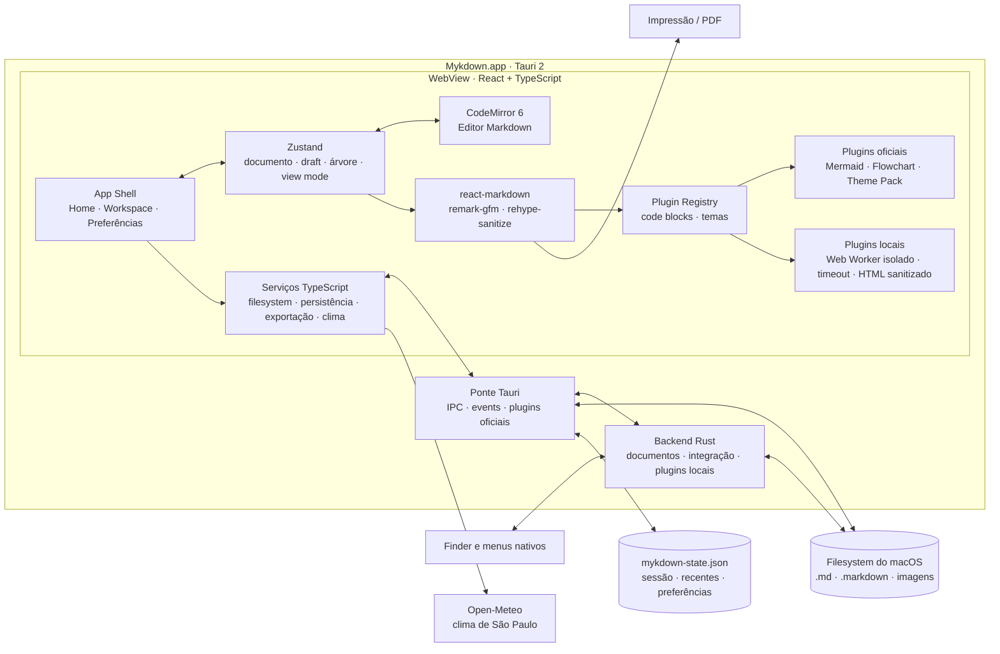

# Mykdown

Editor Markdown minimalista para macOS, pensado para abrir arquivos e pastas comuns do sistema sem vault, importação ou banco de dados.

O Mykdown está na versão oficial `1.3.1`. O filesystem é a fonte da verdade e o primeiro alvo é exclusivamente um Mac Apple Silicon para uso pessoal. Não houve um MVP separado ou descartável: toda implementação faz parte da base de produção.

A versão oficial inclui Home com clima atual de São Paulo e arquivos recentes,
editor e preview, Mermaid, Flowchart, busca fuzzy, integração com Finder, temas
do sistema e o pacote Nord, Dracula e Coffee, exportação HTML/PDF e plugins
locais isolados.

## Documentação

- [Visão e requisitos](./docs/plano-editor-markdown.md)
- [Plano de implementação](./docs/PLANO_IMPLEMENTACAO.md)
- [Desenvolvimento de plugins](./docs/PLUGINS.md)
- [Checklist de release](./docs/SMOKE_TEST.md)

## Stack definida

- Tauri 2
- React + TypeScript + Vite
- CodeMirror 6
- `react-markdown`/remark/rehype para o preview
- Zustand para estado de interface
- Arquitetura de plugins para diagramas, temas e extensões locais isoladas

## Arquitetura



O filesystem do macOS é a fonte da verdade. A interface mantém somente o estado
de trabalho em memória; leitura, observação e diálogos passam pelos plugins do
Tauri, enquanto mutações sensíveis e gravações atômicas são validadas no backend
Rust. O registro de plugins conecta extensões oficiais e locais ao preview sem
acoplar o editor a cada implementação.

## Desenvolvimento

```bash
npm install
npm run tauri dev
```

Validação local:

```bash
npm run lint
npm test
npm run build
cd src-tauri && cargo check
```

O bundle macOS é gerado com:

```bash
npm run tauri build -- --bundles app
```

## Instalação no Mac

Feche uma versão aberta do Mykdown e execute:

```bash
npm run install:local
```

O script valida o build, substitui `/Applications/Mykdown.app` e abre a nova
versão. Depois da instalação, o Mykdown aparece no menu **Abrir com** de
arquivos `.md` e `.markdown` no Finder. Para torná-lo o editor padrão, use
**Obter Informações → Abrir com → Mykdown → Alterar Tudo** em um arquivo
Markdown.
